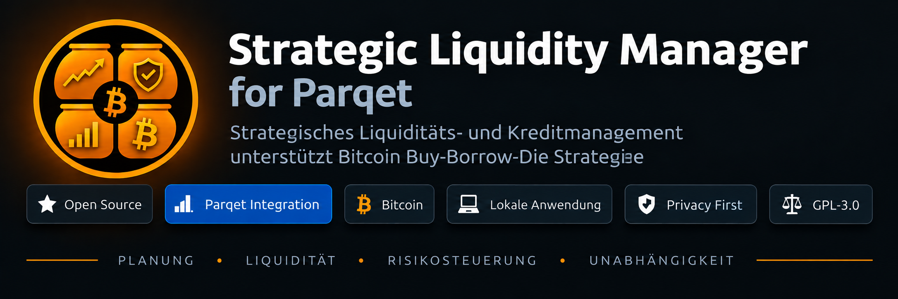
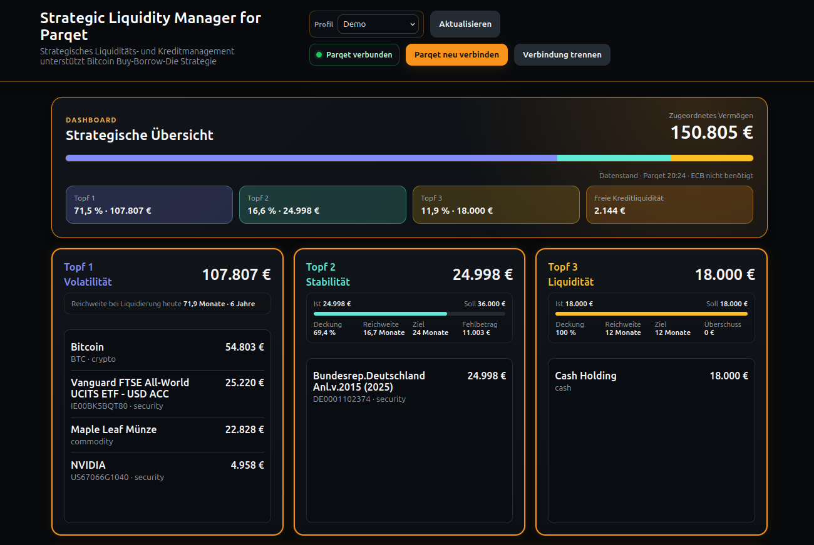
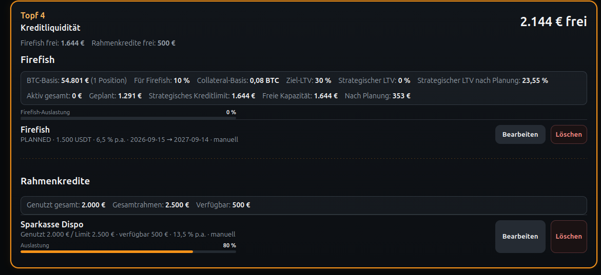
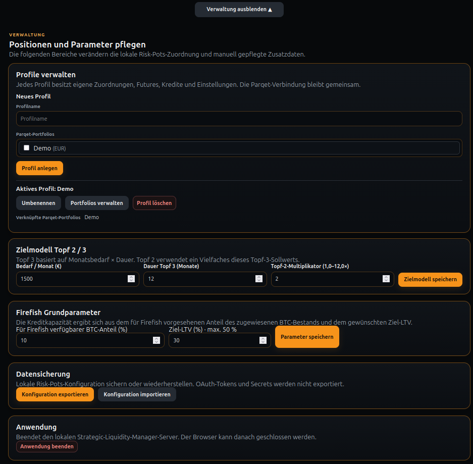
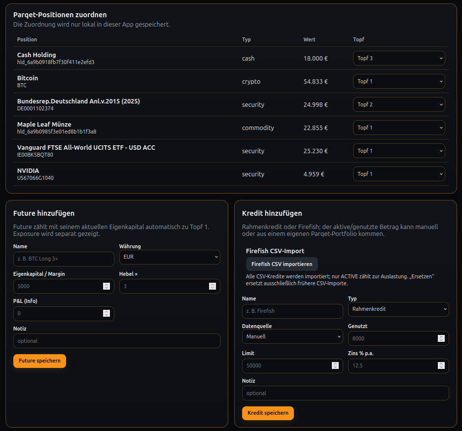

# Strategic Liquidity Manager



**Strategische Liquiditätsplanung auf Basis deiner Parqet-Portfolios.**

Strategic Liquidity Manager (SLM) ist eine lokale Open-Source-Anwendung, die Parqet um eine strategische Liquiditäts- und Risikoperspektive ergänzt. Statt nur den aktuellen Vermögenswert zu betrachten, beantwortet SLM vor allem eine praktische Frage:

> **Wie lange deckt mein vorhandenes Vermögen meinen Liquiditätsbedarf, ohne dass langfristige Anlagen zu einem ungünstigen Zeitpunkt verkauft werden müssen?**

SLM unterstützt dabei insbesondere **Bitcoin-orientierte Buy-Borrow-Die-Strategien**: Langfristig gehaltene Bitcoin können als Risiko-/Wachstumskapital betrachtet werden, während liquide Reserven und kreditbasierte Liquidität separat geplant werden. So wird sichtbar, wie lange der persönliche Liquiditätsbedarf gedeckt werden kann, ohne langfristige Bitcoin-Bestände zu einem ungünstigen Zeitpunkt verkaufen zu müssen.

Das Modell ist jedoch **nicht auf Bitcoin beschränkt**. Die drei Töpfe können frei mit beliebigen in Parqet geführten Vermögenswerten belegt werden.

## Vorschau



*Strategische Übersicht eines vollständig fiktiven Demo-Portfolios.*

## Download

**Aktuelle Version: v1.4.1**

Fertige Distributionen stehen für **Windows x64** und **Linux x64** zur Verfügung:

- Windows x64 – ZIP
- Linux x64 – DEB
- Linux x64 – TAR.GZ

**[Aktuellen Release herunterladen](https://github.com/LIFESHIFTX/strategic-liquidity-manager/releases/latest)**

SHA-256-Prüfsummen werden mit jedem Release als `SHA256SUMS.txt` bereitgestellt.

## Das Drei-Töpfe-Modell

SLM ordnet bestehende Parqet-Positionen drei frei definierbaren Funktionen zu:

- **Topf 1 – Risiko / Wachstum:** langfristig orientiertes, volatileres Kapital.
- **Topf 2 – mittelfristige Liquidität:** Reserve für einen längeren Planungshorizont.
- **Topf 3 – kurzfristige Liquidität:** unmittelbar bzw. kurzfristig verfügbare Reserve.

Die Töpfe sind bewusst **nicht an bestimmte Assetklassen gebunden**. Der Nutzer entscheidet selbst, welche Position welche Funktion erfüllt.

Zusätzlich können manuelle **Futures**, klassische **Kreditlinien** sowie **Kredite** berücksichtigt werden. Ein besonderer Schwerpunkt liegt auf Bitcoin-besicherten Krediten. Für **Firefish** unterstützt SLM derzeit zusätzlich den automatischen Import entsprechender Kreditpositionen.

## Zielmodell und Reichweite

Aus dem persönlichen monatlichen Liquiditätsbedarf berechnet SLM unter anderem:

- Ist- und Sollwerte für Topf 2 und Topf 3
- Deckungsgrade
- Fehlbetrag bzw. Überschuss
- Reichweite in Monaten
- Zielreichweite
- Reichweite von Topf 1 bei Liquidierung zum heutigen Marktwert

So wird aus einer reinen Vermögensübersicht ein strategisches Liquiditätsmodell.

## Funktionen

- strategisches Drei-Töpfe-Liquiditätsmodell
- besondere Unterstützung für Bitcoin Buy-Borrow-Die-Strategien
- Verbindung mit Parqet über OAuth 2.0 Authorization Code Flow mit PKCE
- ausschließlich lesender Parqet-Zugriff (`portfolio:read`)
- mehrere Parqet-Portfolios pro Profil
- mehrere lokale Profile
- Zuordnung von Parqet-Positionen zu Topf 1, 2 oder 3
- manuelle Futures inklusive Exposure und P&L
- manuell gepflegte Kreditlinien und Kredite
- Unterstützung Bitcoin-besicherter Kredite
- automatischer Import von Firefish-Krediten
- Darstellung verfügbarer Kreditliquidität
- strategisches Liquiditäts-Zielmodell
- Reichweite in Monaten und Jahren
- Backup und Restore der lokalen Konfiguration
- lokale Datenspeicherung ohne eigenen SLM-Cloud-Dienst
- kontrolliertes Beenden der Anwendung
- Distribution für Windows x64 und Linux x64


### Bitcoin-besicherte Kredite und Kreditliquidität



*Planung eines fiktiven Firefish-Kredits zusammen mit einer klassischen Kreditlinie.*

## Datenschutz und Sicherheitsmodell

SLM läuft lokal auf dem Rechner des Nutzers. Der lokale Server lauscht auf `127.0.0.1`.

Die Verbindung zu Parqet erfolgt über OAuth 2.0 mit PKCE. SLM fordert ausschließlich den Scope:

```text
portfolio:read
```

Damit besitzt SLM keine Schreibrechte für Parqet-Portfolios und kann dort keine Transaktionen oder Änderungen durchführen.

SLM speichert kein Parqet-Passwort. OAuth-Tokens, Profile, Zuordnungen, Futures, Kredite und Einstellungen werden lokal im Benutzerbereich gespeichert.

SLM betreibt keinen eigenen Cloud-Dienst und benötigt kein zusätzliches SLM-Benutzerkonto.

## Installation

Die fertigen Pakete werden unter **GitHub Releases** bereitgestellt. Für die Distributionen muss Node.js beim Endanwender nicht installiert sein.

### Windows 10/11 x64

1. Die aktuelle Windows-ZIP-Datei aus GitHub Releases herunterladen.
2. ZIP vollständig in einen eigenen Ordner entpacken.
3. `launch.cmd` doppelklicken.
4. SLM startet lokal und öffnet sich im Standardbrowser.
5. **Mit Parqet verbinden** auswählen.
6. Bei Parqet anmelden und die gewünschten Portfolios freigeben.

Zum Beenden in SLM **Verwaltung → Anwendung beenden** wählen. Ein erneuter Start erfolgt wieder über `launch.cmd`.

### Linux Mint / Ubuntu / Debian x64

Für Debian-basierte Systeme ist das `.deb` der einfachste Installationsweg.

1. Die aktuelle `.deb`-Datei aus GitHub Releases herunterladen.
2. Das Paket installieren, zum Beispiel:

```bash
sudo apt install ./parqet-strategic-liquidity-manager_1.4.1_amd64.deb
```

3. **Strategic Liquidity Manager** aus dem Anwendungsmenü starten.
4. **Mit Parqet verbinden** auswählen.
5. Bei Parqet anmelden und die gewünschten Portfolios freigeben.

Zum Beenden in SLM **Verwaltung → Anwendung beenden** wählen. Danach kann die Anwendung jederzeit wieder aus dem Anwendungsmenü gestartet werden.

Alternativ steht für Linux eine portable `.tar.gz`-Distribution zur Verfügung.

## Erste Einrichtung

Nach der Installation:

1. SLM mit Parqet verbinden.
2. Gewünschte Parqet-Portfolios auswählen.
3. Bei Bedarf weitere lokale Profile anlegen.
4. Parqet-Positionen Topf 1, 2 oder 3 zuordnen.
5. Persönlichen Liquiditätsbedarf pro Monat festlegen.
6. Zielreichweite für Topf 3 festlegen.
7. Multiplikator für Topf 2 festlegen.
8. Optional Futures, Kreditlinien oder manuelle Kredite ergänzen.
9. Optional Firefish verbinden bzw. den automatischen Import Bitcoin-besicherter Firefish-Kredite konfigurieren.


### Konfiguration und Verwaltung



*Profile, Zielmodell, Firefish-Grundparameter, Datensicherung und Anwendungssteuerung.*



*Zuordnung von Parqet-Positionen sowie lokale Verwaltung von Futures und Krediten.*

## Backup und Restore

Über den Verwaltungsbereich kann die lokale SLM-Konfiguration als JSON-Datei exportiert und später wiederhergestellt werden.

Ein Backup kann unter anderem enthalten:

- Profile und Portfolio-Zuordnungen
- Topf-Zuordnungen
- Futures
- Kredite und Kreditparameter
- Einstellungen des Liquiditäts-Zielmodells

Backups sollten entsprechend vertraulich behandelt und sicher aufbewahrt werden.

## Anwendung beenden

Das Schließen des Browser-Tabs beendet den lokalen SLM-Server nicht.

Zum vollständigen Beenden:

**Verwaltung → Anwendung beenden**

Der Server wird kontrolliert beendet. Ein Neustart oder Reboot des Rechners ist nicht erforderlich.

## Entwicklung aus dem Quellcode

Voraussetzung: Node.js 18 oder neuer.

```bash
git clone https://github.com/LIFESHIFTX/strategic-liquidity-manager.git
cd strategic-liquidity-manager
npm install
```

Für die lokale Entwicklung wird eine Parqet Client-ID benötigt. Beispiel `.env`:

```text
PARQET_CLIENT_ID=DEINE_CLIENT_ID
BASE_URL=http://localhost:1337
```

Start:

```bash
npm start
```

Danach:

```text
http://localhost:1337
```

**Wichtig:** `.env`, OAuth-Tokens, lokale Benutzerdaten und Backups gehören nicht ins Repository.

## Projekt unterstützen

SLM ist freie Open-Source-Software. Wenn dir die Anwendung einen Mehrwert bietet, kannst du die weitere Entwicklung freiwillig über **Bitcoin / Lightning** unterstützen. Die Unterstützungsfunktion ist direkt in der Anwendung verfügbar.

## Unabhängiges Projekt

Strategic Liquidity Manager ist ein unabhängiges Open-Source-Projekt von **LIFESHIFTX LTD** und keine offizielle Anwendung der Parqet GmbH. Parqet und zugehörige Marken sind Eigentum ihrer jeweiligen Rechteinhaber.

Die Anwendung dient der persönlichen Portfolio- und Liquiditätsanalyse und stellt keine Anlage-, Steuer- oder Rechtsberatung dar.

**Publisher:** LIFESHIFTX LTD  
**Support:** slm.lifeshiftx@pm.me

## Lizenz

Copyright © 2026 LIFESHIFTX LTD

Dieses Projekt wird unter der **GNU General Public License v3.0 only (GPL-3.0-only)** veröffentlicht. Siehe [`LICENSE`](LICENSE).
